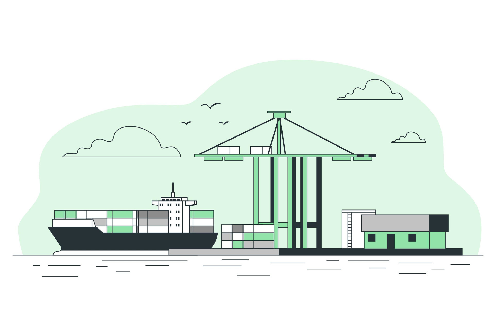

<h1 align="center">🎯 Vessel Tracker</h1>

<p align="center">


</p>

## About

Vessel Tracker is an application for track 🚢 vessels and ⚓ ports around the world.

<a href="https://github.com/thiagotrs/vessel-tracker">Check the version of Application without NgRx</a>

## Technologies

- Angular
- NgRx

## Run Project

### Clone Project

```git
git clone https://github.com/thiagotrs/vessel-tracker.git
```

### WEB

```shell
cd vessel-tracker
npm install
npm start
```

### URLs

```
http://localhost:4200/
```

## Author

Thiago Rotondo Sampaio - [GitHub](https://github.com/thiagotrs) / [Linkedin](https://www.linkedin.com/in/thiago-rotondo-sampaio) / [Email](mailto:thiagorot@gmail.com)

## License

This project use MIT license, see the file [LICENSE](./LICENSE.md) for more details

---

<p align="center">Develop by <a href="https://github.com/thiagotrs">Thiago Rotondo Sampaio</a></p>